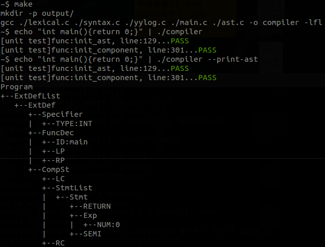

# compiler work

##introduction
* build this project
 * `make`
* run and print syntax tree
 * `./compiler filename --print-ast`
 * or `cat filename | ./compiler --print-ast`

##compiling environment
* OS
 * ubuntu 15.10
* compiler
 * gcc version 5.2.1 20151010
* related script
 * shell script : test.sh
 * python script : genast.py(important)

##example

